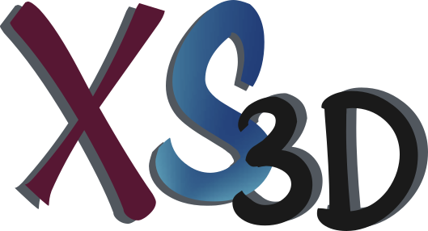
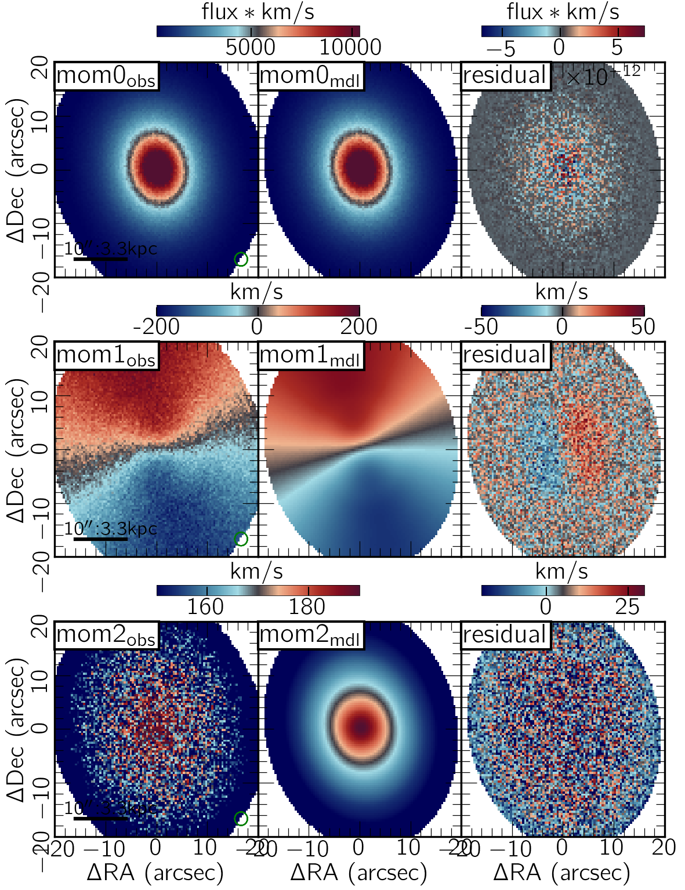
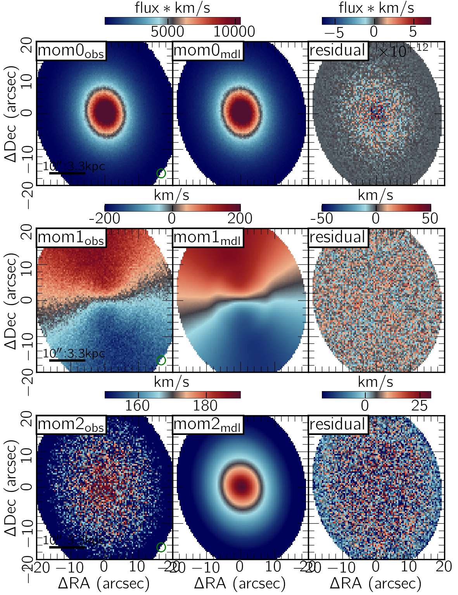
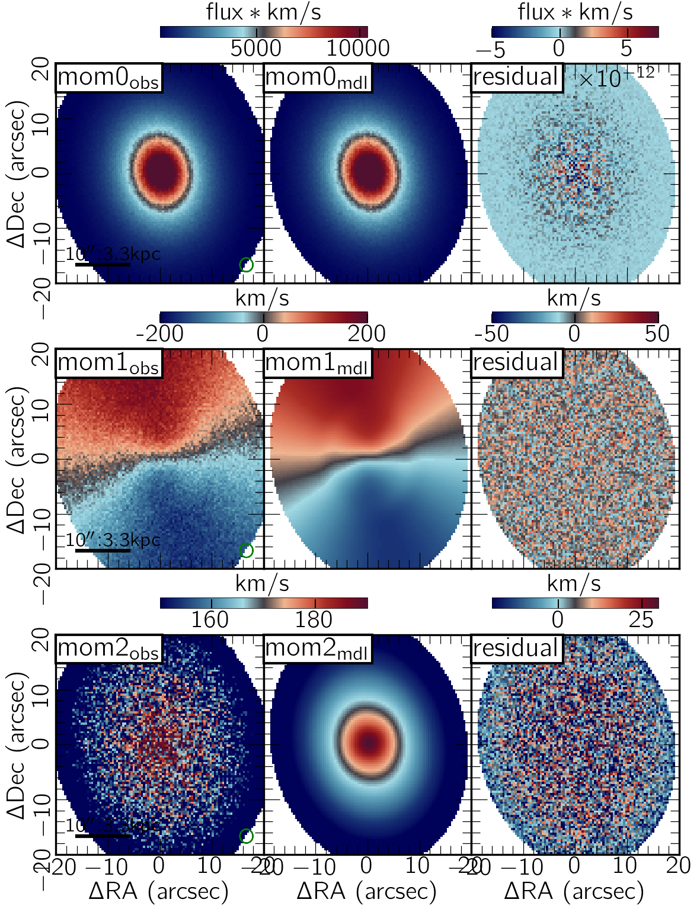
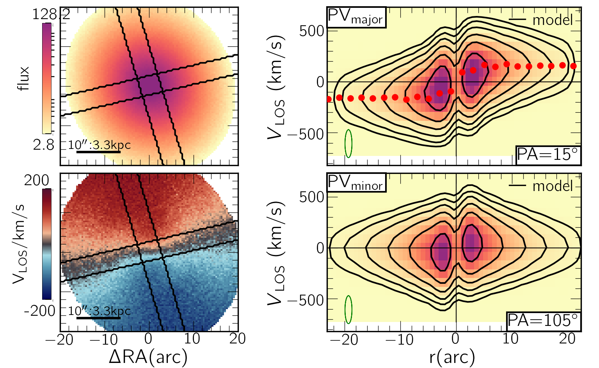
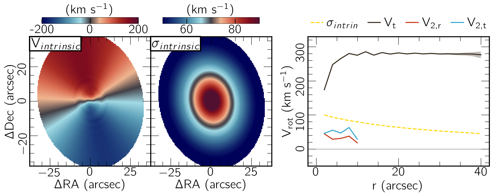

*******************************************
XookSuut3D (XS3D)
*******************************************

|logo|

====

:Authors: Carlos Lopez Coba
:Contact: carlos.lopezcoba@gmail.com

Description
===========
XookSuut3D or XS3D for short, is a python tool developed to model non-circular motions on datacubes.
It is particularly designed for emission-line observations, such as HI, optical emission lines, IR lines,
molecular lines, etc.
A datacube in this context comprises two spatial axes (RA, Dec) and one spectral axis, either wavelength or frequency.
XS3D adopts the same minimization technique as its 2D version, XookSuut, but adapted for datacubes.
XS3D is able to model circular rotation models, axisymmetric radial flows, bisymmetric flows, and a general harmonic decomposition of the LOSV.
To derive the best set of parameters on each kinematic model XS3D uses all the information from the datacube. Therefore,
large dimension cubes could take large CPU time to derive the best model.
XS3D is designed to take advantage of multicores, so using them through the XS3D configuration file is advisable.
 
 
Dependencies
===========

            * ::
            
                Python >= 3.8

Installation
===========

1. Go to the XS3D directory
cd /XookSuut3D-code/

2.  pip install -e .
-e stands for editable, meaning that you will be able to work on the script and invoke the latest version without need to reinstall.

3. Try it. Go to any folder and type XS3D

you must get the following ::

USE: XS3D name cube.fits [error_map.fits,SN] PA INC X0 Y0 [VSYS] vary_PA vary_INC vary_X0 vary_Y0 vary_VSYS ring_space [delta] Rstart,Rfinal cover kin_model [R_bar_min,R_bar_max] [config_file] [prefix]

Uninstall
===========

pip uninstall XS3D

Use
===========

XS3D is designed to run in command line, although you can easely set-up a python script so you can run it as a script.
This could be usefull in case you want to analyse several objects in parallel.
Please read the run_example.txt file to see how to run XS3D.
XS3D requires as input a 3D cube free of continuum emission.
In addition, XS3D requires guess values for the disk geometry, and parameters describing the ring positions on the galaxy plane.
Another input is the desired kinematic model, and in the case of non-circular models, the maximum radial extention of the non-circular flows.

Examples
===========
Following are some of the outputs you will obtain from running XS3d on a datacube. These examples correpond to a galaxy with an an oval distortion.

Results from applying a circular rotation model:
|circ|

Bisymmetric Results from applying a bisymmetric  model::
|bis|

Harmonic expasion with harmonic number m  = 2
|hrm|

Following are shown some other outputs from XS3D.

Position velocity diagrams (PVD) along the major and minor axis:
|pvd|

Intrinsinc rotation and intrinsic velocity dispersion.
|rotation_curve|

Referencing XookSuut3D
=================
 
If you are using XS3D in your work, please cite the XS release paper https://ui.adsabs.harvard.edu/abs/2024RMxAA..60...19L/abstract.
A version for 3D is ongoing.
Also, if you use the XS colormap (red-black-blue) in a different context, I would appreciate it, if you include XS in the acknowledgment section.

